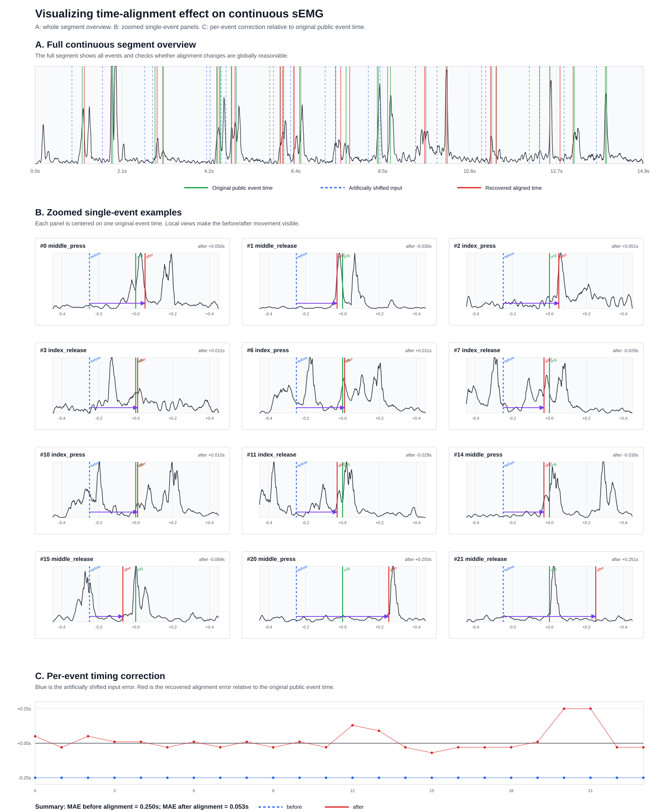
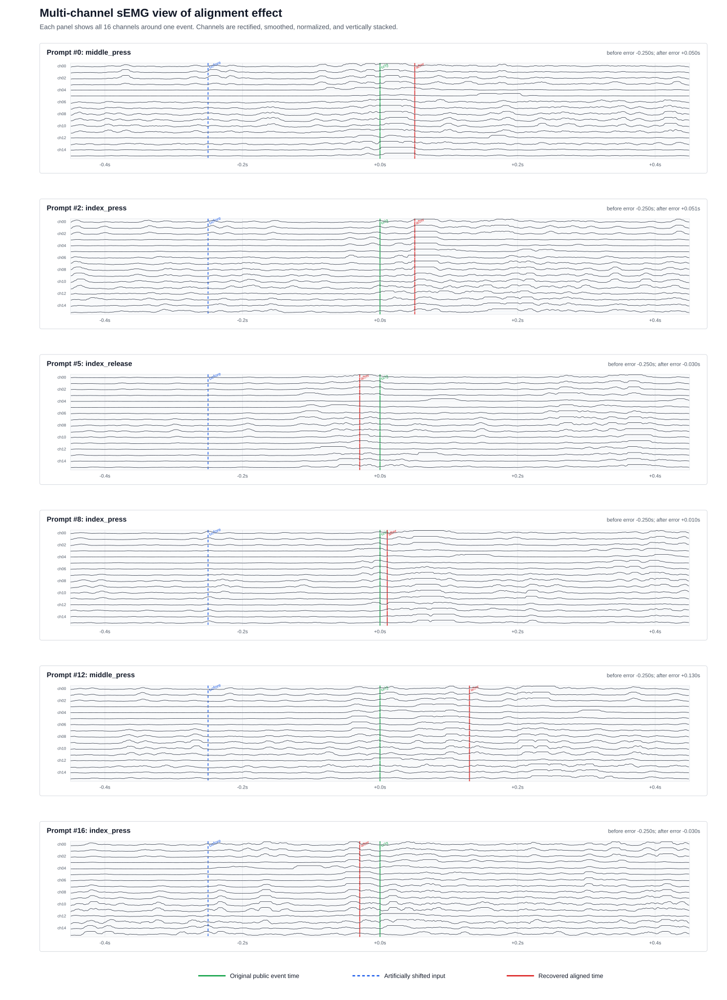

# Discrete Gesture Time Alignment 可视化与代码复现报告

## 1. 报告目的

本报告总结目前对 discrete gesture time alignment 的复现进展，并展示两类可视化结果：

1. 总体对齐效果图：展示连续 sEMG 片段中多个 gesture event 在对齐前后的整体变化。
2. 多通道局部图：展示单个 gesture 附近 16 个 sEMG 通道的响应，用于检查 aligned time 是否落在多通道共同的 EMG 活动附近。

当前实验使用公开数据中的 `prompts.time` 作为 pseudo ground truth event time。为了测试 alignment 是否有效，我们人为将 event time 提前 `0.25s`，把它模拟成未对齐的 prompt/event label，再运行我们复现的 alignment 代码，看它是否能把时间拉回原 event time 附近。

---

## 2. 数据与实验设置

使用的数据文件：

```text
/Users/yoooung/Desktop/generic-neuromotor-interface/data/discrete_gestures_user_000_dataset_000.hdf5
```

HDF5 中的主要内容：

```text
data:
  连续 sEMG 数据，采样率约 2000 Hz，每个时间点有 16 个 EMG 通道。

prompts:
  gesture event 表，包含 name 和 time。
```

本次可视化实验流程：

```text
public event time
    ↓
人为提前 0.25s
    ↓
作为 shifted input time 输入 alignment
    ↓
得到 recovered aligned time
    ↓
和原 public event time 比较
```

图中的颜色含义：

```text
绿色 = 原 public event time
蓝色虚线 = 人为偏移后的 input time
红色 = alignment 后恢复出的 aligned time
黑色 = sEMG 信号或通道 envelope
```

---

## 3. 总体对齐效果图

总体图用于回答：

```text
alignment 是否在整段连续 sEMG 上表现合理？
事件顺序有没有错乱？
对齐后的时间是否整体靠近原 public event time？
```

图中包含三部分：

```text
A. Full continuous segment overview
   显示连续片段中的所有事件，检查整体分布和对齐后位置。

B. Zoomed single-event examples
   多个单事件局部放大图，每个 panel 展示一个 gesture 附近的对齐前后变化。

C. Per-event timing correction
   逐事件误差图，显示对齐前后的 timing error。
```



本次实验结果：

```text
对齐前平均绝对误差 MAE = 0.250s
对齐后平均绝对误差 MAE = 0.053s
```

这说明在这个人为偏移实验中，当前 alignment 代码能够把大部分 event time 从偏移后的输入位置拉回到接近原 public event time 的位置。

---

## 4. 多通道 sEMG 对齐图

只画一条 RMS/envelope 汇总线虽然清楚，但会把 16 个 sEMG 通道压缩成一条曲线，隐藏空间分布信息。因此我们额外画出多通道图。

多通道图用于回答：

```text
aligned time 是否落在多个通道共同出现 EMG 响应的位置？
alignment 是否只是贴合了一条合成 envelope 的偶然峰值？
不同 gesture 周围是否存在不同的 channel response pattern？
```

每个 panel 展示一个 gesture 附近的局部窗口，包含 `ch00` 到 `ch15` 共 16 个通道。每个通道经过 rectification、smoothing 和 display normalization 后纵向堆叠显示。



这个图比单条 envelope 更适合说明：

```text
sEMG 是多通道空间信号；
对齐结果应该和多个通道上的肌电响应一致；
MPF/rERP alignment 的输入本质上也是多通道 feature，而不是单通道信号。
```

---

## 5. 当前完成的代码

核心代码文件：

```text
/Users/yoooung/Desktop/generic-neuromotor-interface/generic_neuromotor_interface/discrete_gesture_alignment.py
```

命令行工具：

```text
/Users/yoooung/Desktop/generic-neuromotor-interface/generic_neuromotor_interface/scripts/discrete_gesture_alignment.py
```

测试文件：

```text
/Users/yoooung/Desktop/generic-neuromotor-interface/generic_neuromotor_interface/tests/test_discrete_gesture_alignment.py
```

### 5.1 数据读取与 prompt pattern 分析

已实现：

```text
load_discrete_gesture_hdf5(...)
  读取 HDF5 中的连续 sEMG 和 prompts 表。

summarize_prompt_pattern(...)
  统计 prompt/event 间隔、数量、sequence 长度。

group_overlapping_sequences(...)
  根据 uncertainty window 将重叠的 prompts 分成 sequence。
```

用途：

```text
分析公开数据里的 event 间隔；
判断为什么多个手势会因为 uncertainty range 重叠而形成 sequence；
为后续 beam search alignment 分组。
```

### 5.2 Feature extraction

已实现：

```text
emg_envelope_features(...)
  简化版 envelope feature，用于快速测试和可视化。

multivariate_power_frequency_features(...)
  MPF feature 复现入口，输出形状为：
  (time, frequency_bins * channels * channels)
```

说明：

```text
envelope feature 更轻量，适合快速 debug；
MPF feature 更接近论文方法，适合正式复现实验。
```

### 5.3 Template estimation

已实现两种 template estimator：

```text
estimate_templates_average(...)
  baseline 方法：围绕 event time 截窗口，然后对同类 gesture 平均。

estimate_templates_rerp(...)
  rERP 方法：用 regression-based ERP analogue 联合估计 gesture templates，
  用于分离快速连续手势中重叠的 EMG contribution。
```

rERP 的核心思想：

```text
features ~= design_matrix @ template_coefficients + intercept
```

每个 gesture class 有一组 lag regressors。多个 gesture 即使在时间上重叠，也会在同一个 regression model 中联合解释观测到的连续 feature。

### 5.4 Beam search alignment

已实现：

```text
align_prompt_times(...)
  迭代执行 template estimation 和 event time search。

_align_sequence(...)
  对 uncertainty intervals 重叠的 gesture sequence 做联合 beam search。

_align_single_event(...)
  对 isolated event 做单事件搜索。
```

beam search 的目标函数：

```text
minimize || observed_features - sum(shifted_templates) ||^2
```

也就是寻找一组 event times，使得这些 gesture templates 平移并叠加后，最能解释观测到的连续 sEMG feature。

当前 beam search 还加入了：

```text
monotonic event order constraint
minimum event separation
prompt prior penalty
```

这些约束用于避免快速连续手势中出现时间顺序反转或不合理的大幅跳动。

### 5.5 Recentering

已完成两类 recentering：

```text
recenter_template_bank(...)
  简化版：把每个 template 的能量峰移动到 event time zero 附近。

build_global_template_bank(...)
  多个 session/participant template 做 grand average，得到 global template。

recenter_template_bank_to_reference(...)
  用 session template 和 global/reference template 的最大相关位置估计 shift。

apply_recenter_shifts_to_aligned_prompts(...)
  把 template shift 转换成 aligned_time 的反向修正。
```

关键符号关系：

```text
如果 template 需要向右 shift s 个 samples 才能对齐 global template，
那么 aligned_time 要向左移动 s / sample_rate 秒。
```

这是因为 template 的时间坐标和 event timestamp 是相对定义；template 移动和 timestamp 修正方向相反。

### 5.6 CLI 工具

目前命令行工具支持：

```text
inspect
  分析 prompt/event pattern。

align
  运行 forced alignment，并输出 aligned prompts CSV。

plot
  画 raw sEMG envelope 与 prompt/aligned timestamps。
```

示例命令：

```bash
cd /Users/yoooung/Desktop/generic-neuromotor-interface
source .venv/bin/activate

python3 -m generic_neuromotor_interface.scripts.discrete_gesture_alignment align \
  data/discrete_gestures_user_000_dataset_000.hdf5 \
  data/user_000_mpf_rerp_aligned_prompts.csv \
  --feature mpf \
  --template-estimator rerp \
  --template-ridge 0.001 \
  --monotonic \
  --min-event-separation 0.02 \
  --prompt-prior-weight 0.1 \
  --candidate-step 0.02 \
  --beam-width 30
```

---

## 6. 当前验证情况

已添加测试覆盖：

```text
sequence grouping
prompt pattern summary
average template estimation
rERP template estimation
beam search monotonic constraint
MPF feature shape and timestamps
global template bank averaging
reference-template recentering
recenter shift to aligned_time conversion
```

当前测试结果：

```text
10 passed
```

运行命令：

```bash
cd /Users/yoooung/Desktop/generic-neuromotor-interface
source .venv/bin/activate
python -m pytest generic_neuromotor_interface/tests/test_discrete_gesture_alignment.py
```

---

## 7. 与论文完整复现的差距

目前代码已经复现了论文方法中的主要结构：

```text
continuous sEMG
prompt/event uncertainty sequence grouping
MPF feature
rERP template estimation
beam search forced alignment
template recentering
alignment visualization
```

但仍然存在几个差距：

```text
1. 公开数据没有 raw UI prompt schedule
   因此无法直接比较 raw prompt time 和官方 aligned time 的真实差值。

2. 当前可视化实验使用人为偏移
   我们把 public event time 提前 0.25s 来模拟未对齐标签。
   这可以验证算法逻辑，但不等价于复现官方原始采集过程。

3. 当前展示图使用 rERP + envelope 的快速实验结果
   MPF + rERP 已经实现，但正式大规模运行需要更多 prompts/session，
   不能只用很少事件估计高维 MPF template。

4. Global recentering 代码已实现
   但真正复现论文中的 global template recentering 需要多个 participant/session
   的 template bank 作为 reference。
```

---

## 8. 后续建议

下一步建议按以下顺序推进：

```text
1. 用更多 prompts 跑正式 MPF + rERP alignment。

2. 对多个 user/session 估计 template bank，
   构建 global template bank，并运行 reference-based recentering。

3. 用 alignment 后的 prompts 生成新的 target pulse，
   比较 prompt-time label 和 aligned-time label 对训练结果的影响。

4. 如果后续自己采集数据，
   必须同时保存 raw UI prompt schedule、sEMG raw data、event metadata、
   以及每个 trial/stage 的 protocol timing。
```

如果自己采集数据，至少需要保存：

```text
continuous sEMG:
  16 通道原始或滤波后的连续信号，带绝对 timestamp。

raw prompt schedule:
  UI 什么时候提示用户做哪个 gesture。

gesture metadata:
  gesture name、stage、posture、block/session/user id。

protocol timing:
  每个 stage 的 start/end，每个 gesture 间隔设计，是否存在 rapid sequence。

optional annotation:
  如果可能，保存人工标注或外部传感器记录，用于验证 alignment 是否准确。
```

